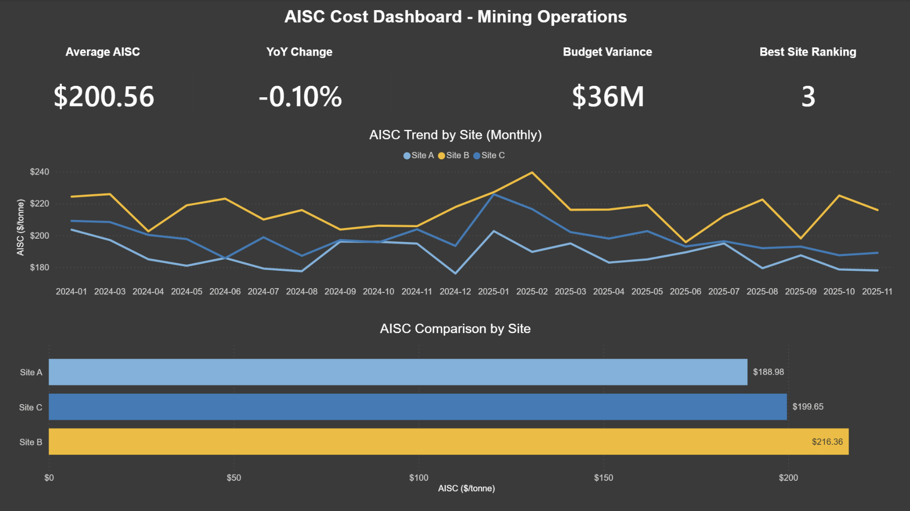
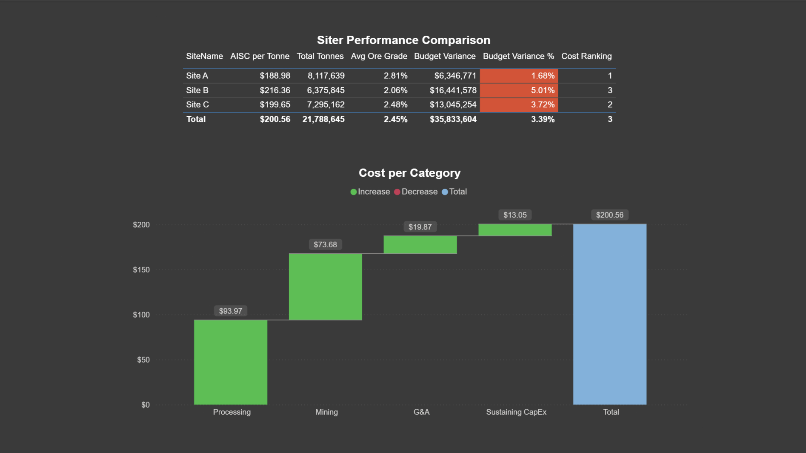
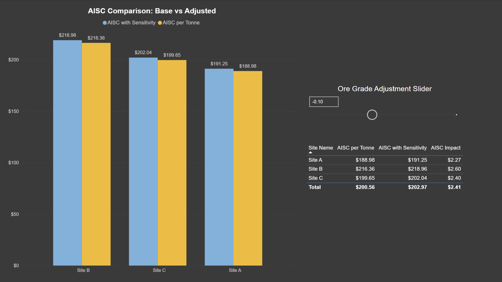

# Project 5: AISC Cost-Per-Tonne Dashboard

**Mining Operations Financial Analytics | Power BI Portfolio Project**


---

## Project Overview

An end-to-end Business Intelligence solution for mining operations cost analysis, tracking **All-In Sustaining Cost (AISC)** — the gold-standard metric for mining company competitiveness. Built to demonstrate financial analytics capabilities for Perth's mining sector (BHP, Rio Tinto, Fortescue).

**Business Problem:** Mining operators must track AISC to remain competitive. Bottom-quartile cost producers survive commodity downturns while high-cost producers shut down. This dashboard tracks AISC by site, identifies cost reduction opportunities, and models sensitivity to ore grade changes.

---

## Key Business Insights

| Metric | Value | Status |
|--------|-------|--------|
| **Site A AISC** | $188.98/t | ✅ Bottom Quartile (Competitive) |
| **Site B AISC** | $216.36/t | ⚠️ Top Quartile (Needs Intervention) |
| **Site C AISC** | $199.65/t | ✅ Second Quartile (Acceptable) |
| **Ore Grade Impact** | ±0.5% grade = ±$11-13/t AISC | 📈 High Sensitivity |
| **Seasonal Effect** | Q1 costs +8% vs Q2-Q4 | ⛈️ Cyclone Season Impact |
| **Cost Structure** | Processing (47%) + Mining (37%) = 84% | 🎯 Optimization Focus |

---

## Features

### Interactive Dashboards (3 Pages)

**Page 1: Cost Overview**
- 4 KPI cards (Avg AISC, YoY Change, Budget Variance, Cost Ranking)
- AISC trend analysis (24 months, by site)
- Site comparison bar chart

**Page 2: Site Performance Deep-Dive**
- Cost breakdown waterfall chart (Mining → Processing → G&A → CapEx)
- Detailed site comparison table with conditional formatting
- Budget variance tracking by category

**Page 3: Sensitivity Analysis** 
- Interactive ore grade slider (-0.5% to +0.5%)
- Real-time AISC impact calculation
- Base vs. adjusted scenario comparison

---

## Tech Stack

- **Data Generation:** Python (Pandas, NumPy, SQLite3)
- **Database:** SQLite (Star Schema: 1 Fact + 3 Dimensions)
- **Analytics:** SQL (8 analytical queries)
- **Visualization:** Power BI Desktop
- **Calculations:** DAX (10+ measures including sensitivity modeling)
- **Version Control:** Git/GitHub

---

## 📁 Project Structure

```
Project5_AISC_Dashboard/
├── README.md
├── notebooks/
│   ├── Project5_AISC_DataGeneration.ipynb
│   └── Project5_AISC_SQL_Queries.ipynb
├── data/
│   ├── mining_cost_data.csv (288 records)
│   ├── mining_aisc_costs.db (SQLite database)
│   └── query_outputs/
│       ├── query1_aisc_by_site.csv
│       ├── query2_cost_breakdown.csv
│       └── query3_budget_variance.csv
├── dashboard/
│   └── Project5_AISC_Dashboard.pbix
├── documentation/
│   └── DAX_Measures_Documentation.md
└── screenshots/
    ├── page1_cost_overview.png
    ├── page2_site_performance.png
    └── page3_sensitivity_analysis.png
```

---

## Dashboard Screenshots

### Page 1: Cost Overview


### Page 2: Site Performance


### Page 3: Sensitivity Analysis


---

## Data Model

**Star Schema Design:**

```
           DimSite ──────┐
                         │
           DimDate ──────┼────→ FactCosts (288 records)
                         │
     DimCostCategory ────┘
```

**Fact Table:** FactCosts (3 sites × 24 months × 4 cost categories)

**Dimensions:**
- DimSite: 3 mine sites (Pilbara, Goldfields, Mid-West WA)
- DimDate: 24 months (Jan 2024 - Dec 2025)
- DimCostCategory: 4 categories (Mining, Processing, G&A, Sustaining CapEx)

---

## 📈 Key DAX Measures

### 1. AISC per Tonne (Primary Metric)
```dax
AISC per Tonne = 
DIVIDE(
    SUM(FactCosts[TotalCost_Actual]),
    SUM(FactCosts[UniqueTonnes])
)
```

### 2. Budget Variance %
```dax
Budget Variance % = 
DIVIDE(
    [Budget Variance],
    SUM(FactCosts[TotalCost_Budget])
)
```

### 3. AISC with Sensitivity (What-If Analysis)
```dax
AISC with Sensitivity = 
VAR Adjustment = SELECTEDVALUE('Ore Grade Adjustment'[Ore Grade Adjustment], 0)
RETURN [AISC per Tonne] * (1 + (Adjustment * -0.12))
```

**[Full DAX documentation →](documentation/DAX_Measures_Documentation.md)**

---

## Business Value

**Demonstrates:**
- Financial analytics (not just operational metrics)
- Budget variance tracking and management
- Sensitivity modeling for strategic decisions
- Commercial awareness of mining economics
- End-to-end BI pipeline (Python → SQL → Power BI)

**Target Audience:** Perth mining sector corporate offices (Finance, Strategy, Operations)

---

## Technical Skills Demonstrated

| Skill | Application |
|-------|-------------|
| **Python** | Synthetic data generation with realistic business patterns |
| **SQL** | Complex cost allocation, variance analysis, quartile ranking |
| **Data Modeling** | Star schema design, relationship management |
| **DAX** | Advanced calculations, time intelligence, what-if parameters |
| **Power BI** | Interactive dashboards, conditional formatting, slicers |
| **Business Intelligence** | KPI design, financial reporting, sensitivity analysis |

---

## How to Use

### Prerequisites
- Power BI Desktop (latest version)
- Python 3.8+ (for data generation)
- SQLite ODBC driver (for database connection)

### Quick Start

1. **Clone the repository:**
```bash
git clone https://github.com/FlavioColtellacci/Project5_AISC_Dashboard.git
cd Project5_AISC_Dashboard
```

2. **Open the Power BI dashboard:**
```
Open dashboard/Project5_AISC_Dashboard.pbix in Power BI Desktop
```

3. **Explore the data:**
   - Review `/data` folder for raw data and query outputs
   - Check `/notebooks` for data generation and SQL analytics code
   - Read `/documentation` for detailed DAX explanations

---

## Reproducing the Project

### Step 1: Generate Data
```bash
# Run the Python notebook to create synthetic mining cost data
jupyter notebook notebooks/Project5_AISC_DataGeneration.ipynb
```

### Step 2: Execute SQL Queries
```bash
# Run SQL analytics notebook
jupyter notebook notebooks/Project5_AISC_SQL_Queries.ipynb
```

### Step 3: Load into Power BI
1. Open Power BI Desktop
2. Get Data → ODBC → Connect to `mining_aisc_costs.db`
3. Load all 4 tables (FactCosts, DimSite, DimDate, DimCostCategory)
4. Create relationships and DAX measures (see documentation)

---

## Learning Resources

**AISC in Mining:**
- [Understanding AISC](https://www.mining.com/what-is-all-in-sustaining-cost-aisc/)
- [Cost Competitiveness in Mining](https://www.mckinsey.com/industries/metals-and-mining)

**Power BI Best Practices:**
- [Star Schema Design](https://docs.microsoft.com/en-us/power-bi/guidance/star-schema)
- [DAX Patterns](https://www.daxpatterns.com/)

---

## Project Context

**Portfolio Project #5** in my career transition from Real Estate Management → Business Intelligence/Business Analytics

**Why This Project:**
- Demonstrates **financial analytics** (balances operational focus of Projects #3 & #4)
- Shows understanding of **AISC** (THE foundational metric for Perth mining sector)
- Proves **commercial acumen** and business value delivery
- Targets Perth corporate office roles (BHP, Rio Tinto, Fortescue, mining services)

**Other Portfolio Projects:**
- Project #3: Drilling Performance Analytics
- Project #4: Predictive Maintenance Dashboard
- Project #5: AISC Cost Analysis (this project)

---

## Author

**Flavio Coltellacci**

- GitHub: [@FlavioColtellacci](https://github.com/FlavioColtellacci)
- LinkedIn: [linkedin.com/in/flaviocoltellacci](https://linkedin.com/in/flaviocoltellacci)

---

## License

This project is open source and available under the [MIT License](LICENSE).

---

## Acknowledgments

- Mining cost data patterns based on public industry benchmarks
- Dashboard design inspired by mining industry financial reporting standards
- Built to demonstrate real-world BI capabilities for Perth mining sector

---

*Last Updated: February 2026*
